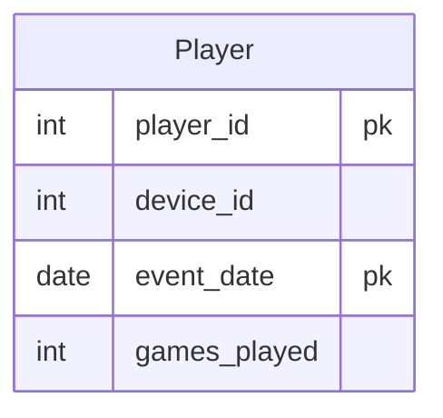

# leetcode : 197. Rising Temperature
* [[leetcode : 197. Rising Temperature]](https://leetcode.com/problems/game-play-analysis-i/description/)
<br>

---

### **다이어그램**


### **목표**
> Write a solution to `find the first login date for each player.`
> 
> `유저 별 가장 로그 빠른 시간 찾기`
<br>

## 문제 풀이

### **MySQL**
```SQL
--  Solution 1
SELECT PLAYER_ID, MIN(EVENT_DATE) AS FIRST_LOGIN
FROM ACTIVITY
GROUP BY PLAYER_ID
```

* Solution 1
  * 각 그룹별 최소 날짜 출력하기
  
### **Pandas**
```python
#  Solution 1
def game_analysis(activity: pd.DataFrame) -> pd.DataFrame:

    activity['event_date'] = pd.to_datetime(activity['event_date'])
    answer = activity.groupby('player_id')['event_date'].min().reset_index()
    answer.rename(columns={'event_date':'first_login'}, inplace=True)
    return answer

#  Solution 2
def game_analysis(activity: pd.DataFrame) -> pd.DataFrame:
    answer = activity.groupby('player_id').agg(
        first_login = ('event_date','min')
    ).reset_index()
    return answer

#  Solution 3
def game_analysis(activity: pd.DataFrame) -> pd.DataFrame:
    activity.sort_values(by = 'event_date', inplace = True)
    df = activity.drop_duplicates(subset ='player_id', keep='first')
    df.drop(columns = ['device_id','games_played'], inplace=True)
    df.rename(columns = {'event_date':'first_login'}, inplace=True)

    return df
```
* Solution 1,2 : group by + min
  * groupby로 묶은 후, event date 최소값을 가져와주기.

* Solution 3 : sort_values + drop_duplicates
  * 정렬 이후 한 번의 순회로도 풀이가 가능하다.
  * 날짜별 정렬을 한 후, 중복 아이디가 나오면 최소 날짜가 아니므로 제거해준다.

<br>

### **코멘트**

* 쉬운문제
