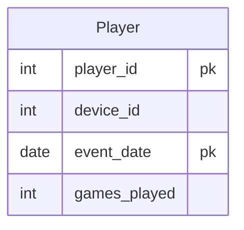

# leetcode : 511. Game Play Analysis IV
* [[leetcode : 511. Game Play Analysis IV]](https://leetcode.com/problems/game-play-analysis-iv/description/)
<br>

---

### **다이어그램**


### **목표**
> Write a solution to `report the fraction of players that logged in again on the day after the day they first logged in, rounded to 2 decimal places.` In other words, you need to count the number of players that logged in for at least two consecutive days starting from their first login date, then divide that number by the total number of players.
>
> `첫로그인 다음날에 접속한 비율 구하기`

<br>

## 문제 풀이

### **MySQL**
```SQL
-- Solution 1
WITH F_LOGIN AS (  -- 첫 로그인 날짜 구하기
    SELECT PLAYER_ID, MIN(EVENT_DATE) AS FIRST_DATE
    FROM ACTIVITY
    GROUP BY PLAYER_ID
),
S_LOGIN AS ( -- 두 번째 로그인 구하기
    SELECT F.PLAYER_ID
    FROM F_LOGIN AS F
    JOIN ACTIVITY AS A ON F.PLAYER_ID = A.PLAYER_ID
    WHERE A.EVENT_DATE = DATE_ADD(F.FIRST_DATE, INTERVAL 1 DAY)
)
SELECT ROUND(COUNT(PLAYER_ID) / (SELECT COUNT(DISTINCT PLAYER_ID) FROM ACTIVITY), 2) AS FRACTION
FROM S_LOGIN;

-- Solution 2
WITH TEMP1 AS (
    SELECT
        PLAYER_ID,
        EVENT_DATE,
        LAG(EVENT_DATE) OVER (PARTITION BY PLAYER_ID ORDER BY EVENT_DATE) AS PREV_DATE,
        ROW_NUMBER() OVER (PARTITION BY PLAYER_ID ORDER BY EVENT_DATE) AS IDX
    FROM
        ACTIVITY
),
TEMP2 AS (
    SELECT
        PLAYER_ID,
        IDX,
        COALESCE(DATEDIFF(EVENT_DATE,PREV_DATE)=1,0) AS AROW
    FROM
        TEMP1
)
SELECT 
    ROUND(SUM(IF(IDX=2 AND AROW=1,1,0))/COUNT(DISTINCT PLAYER_ID),2) AS FRACTION
FROM TEMP2
```

* Solution1: CTE + JOIN
  * CTE에서 유저 별 첫 로그인 날짜 구하기.
  * 구한 CTE로 테이블이랑 JOIN해서 날짜차이가 1인 애들만 구하기.
  * ADDDATE 대신 DATE ADD, 차이를 구할때는 DATE_ADD보다는 DATEDIFF를 사용하자.
  
* Solution2: CTE + 조건부 집계
  * temp1에서 이전 날짜, row num을 구한다.
  * temp2에서 이전 연속접속인지 확인한다.
  * 본 쿼리에서 첫로그인 다음날 + 연접인지 IF문을 통해서 확인한다.
  * BINARY의 경우 CASE WHEN보다는 IF 사용을 선호한다.

### **Pandas**
```python
# Solution 1
def gameplay_analysis(activity: pd.DataFrame) -> pd.DataFrame:

    activity.sort_values(by=['player_id', 'event_date'], inplace=True)
    activity['first_date'] = activity.groupby('player_id')['event_date'].transform('min')

    second = activity[activity['event_date'] == activity['first_date'] + timedelta(days=1)]
    return pd.DataFrame({'fraction':[round(len(second['player_id'].unique())/len(activity['player_id'].unique()),2)]})

# Solution 2
def gameplay_analysis(activity: pd.DataFrame) -> pd.DataFrame:

    n = activity['player_id'].nunique()
    activity = activity.sort_values(['player_id', 'event_date'], ascending=True)
    activity['row_number'] = activity.groupby('player_id').cumcount() + 1
    activity['prev_date'] = activity.groupby('player_id')['event_date'].shift(1)

    cond1 = activity['row_number'] == 2
    cond2 = activity['event_date'] + timedelta(days=-1) == activity['prev_date']
    answer = pd.DataFrame({'fraction': [round(activity[cond1&cond2].shape[0]/n,2)]})
    return answer
```
* Solution 1 : sort_values + group by
  * 각 플레이어 별 첫 접속일을 가져온다.
  * event_date와 첫 접속일 + 1일을 만족하는 데이터 프레임을 가져온다.
  * 전체 플레이어 중 second에 있는 플레이어 수 가져오기
  * min() 대신 transform('min')을 사용해야 사이즈가 맞는 DataFrame이 기존 DataFrame에 병합된다. (기존 데이터에 집계값을 추가)
  
* Solution 2 : sort_values + group by
  * row_number를 cumcount를 사용해서 매긴다.
  * timedelta를 활용해서 날짜 차이 구하기

<br>

### **코멘트**
* MySQL에서 윈도우 함수나 SELECT 절에 CASE WHEN, IF로 채우는 부분들 신경써서 연습하기...
