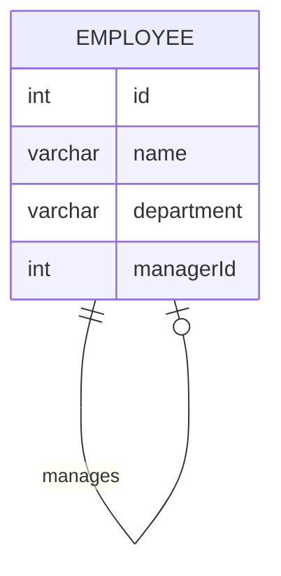

# leetcode : 570. Managers with at Least 5 Direct Reports
* [[leetcode : 570. Managers with at Least 5 Direct Reports]](https://leetcode.com/problems/managers-with-at-least-5-direct-reports/description/)
<br>

---

### **다이어그램**


### **목표**
> Write a solution to `find managers with at least five direct reports.`
>
> `리포팅 5번 이상 나온 매니저 구하기`


<br>

## 문제 풀이

### **MySQL**
```SQL
--  Solution 1
SELECT NAME
FROM EMPLOYEE
WHERE ID IN (
    SELECT MANAGERID
    FROM EMPLOYEE
    WHERE MANAGERID IS NOT NULL
    GROUP BY MANAGERID
    HAVING COUNT(MANAGERID) >= 5)

--  Solution 2
SELECT b.name
FROM Employee a
JOIN Employee b ON a.managerId = b.id
GROUP BY b.id
HAVING COUNT(*) >= 5
```

* Solution 1
  * 테이블에서 MANAGER ID가 5개 이상인 ID들만 추려놓는다.
  * ID가 주어진 서브쿼리 내에 있으면 사용 가능
  
* Solution 2
  * inner join
  
### **Pandas**
```python
# Solution 1
def find_managers(employee: pd.DataFrame) -> pd.DataFrame:
    count = employee.groupby('managerId').size().reset_index(name='cnt')
    condition = count[count['cnt'] >= 5]
    return employee[employee['id'].isin(condition['managerId'])][['name']]

# Solution 2
def find_managers(employee: pd.DataFrame) -> pd.DataFrame:
    counts = pd.DataFrame(employee['managerId'].value_counts())
    merged = pd.merge(employee, counts, left_on='id',right_on='managerId')
    return merged[merged['count']>=5][['name']]
```
* Solution 1: groupby size + isin
  * groupby 이후 조건을 걸어줘서 condition이라는 서브쿼리를 만든다.
  * isin을 사용해서 출력해주기.
  
* Solution 2: value_counts + merge
  * 매니저 등장 횟수를 세고, merge를 통해서 등장한 사람 중 5번 이상만 조건 걸어주기
  
<br>

### **코멘트**
* 기본 문제.