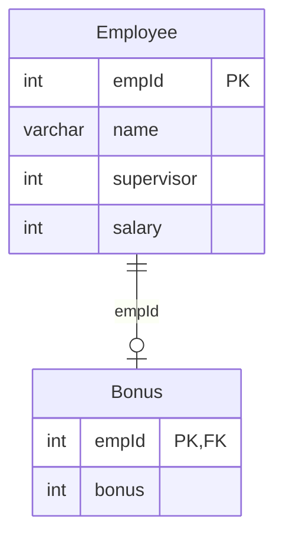

# leetcode : 577. Employee Bonus
* [[leetcode : 577. Employee Bonus]](https://leetcode.com/problems/employee-bonus/description/)
<br>

---

### **다이어그램**


### **목표**
> Write a solution to `report the name and bonus amount of each employee with a bonus less than 1000.`
>
> `보너스 1000보다 작은 직원의 이름과 보너스 합 구하기`

<br>

## 문제 풀이

### **MySQL**
```SQL
-- Solution 1
SELECT NAME, BONUS
FROM EMPLOYEE E
LEFT JOIN BONUS B ON E.EMPID = B.EMPID
WHERE BONUS IS NULL OR BONUS < 1000
```

* Solution 1: LEFT JOIN
  * BONUS가 없는 경우는 테이블에 기록되지 않는다.
  * 이런 사람들도 조회해야 하므로, LEFT JOIN을 해준다.
  * NULL이거나 보너스가 없는 사람들을 조회해주기.
  
### **Pandas**
```python
# Solution 1
def employee_bonus(employee: pd.DataFrame, bonus: pd.DataFrame) -> pd.DataFrame:
    merged = pd.merge(employee, bonus,
                    on='empId', how='left')
    cond1 = merged['bonus']<1000
    cond2 = merged['bonus'].isnull()
    return merged[cond1|cond2][['name','bonus']]

def employee_bonus(employee: pd.DataFrame, bonus: pd.DataFrame) -> pd.DataFrame:
    merged = pd.merge(employee, bonus,
                    on='empId', how='left')
    merged = merged.drop(merged[merged['bonus']>=1000].index)
    return merged[['name','bonus']]
```
* Solution 1: merge + 조건문
  * 같은 방법으로 left join을 통해서 서브 쿼리를 만든다.
  * 이후에 조건을 걸어서 값 가져오기.
  * 1000이상 데이터들을 drop시켜도 된다.

* Solution 1: merge + drop
  * merge 이후 drop으로 조건 만족시키지 않는 row의 index를 구한다.
  
<br>

### **코멘트**
* 기본 조인문제
