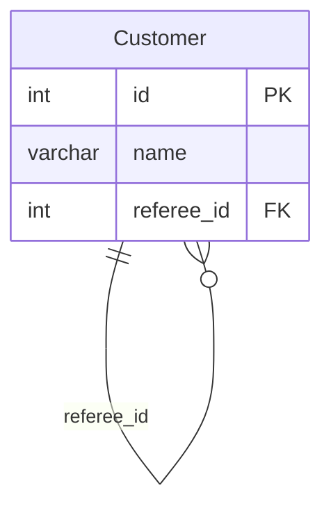

# leetcode : 584. Find Customer Referee
* [[leetcode : 584. Find Customer Referee]](https://leetcode.com/problems/find-customer-referee/)

<br>

---

### **다이어그램**


### **목표**
>Find the `names of the customer that are not referred by the customer with id = 2.`
>
> `referred id가 2가 아닌 행 출력`

<br>

## 문제 풀이

### **MySQL**
```SQL
--  Solution 1
SELECT NAME
FROM CUSTOMER
WHERE REFEREE_ID IS NULL OR REFEREE_ID != 2
```
* Solution 1
  * IS NULL | 조건 연산해주기

  
### **Pandas**
```python
# Solution 1
def find_customer_referee(customer: pd.DataFrame) -> pd.DataFrame:
    return customer[~(customer['referee_id']==2) | customer['referee_id'].isnull()][['name']]

# Solution 2
def find_customer_referee(customer: pd.DataFrame) -> pd.DataFrame:
    return customer.drop(customer[customer['referee_id'] == 2].index)[['name']]
```

* Solution 1
  * OR 조건으로 두 조건을 묶어주기
* Solution 2
  * 또는, drop으로 2인 컬럼을 제거해주기
  
<br>

### **코멘트**
* 기본문제
