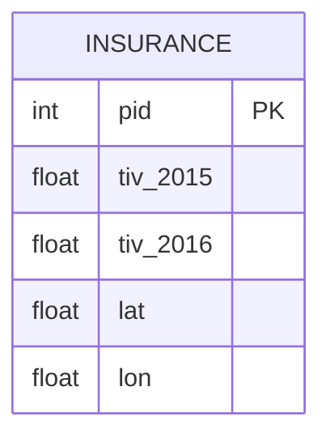

# leetcode : 585. Investments in 2016
* [[leetcode : 585. Investments in 2016]](https://leetcode.com/problems/investments-in-2016/)

---

## **다이어그램**


### **목표**
> Write a solution to report the `sum of all total investment values in 2016 tiv_2016`, for all policyholders who:
>
> `have the same tiv_2015 value as one or more other policyholders`, and
> are `not located in the same city` as any other policyholder (i.e., the (lat, lon) aribute pairs must be unique).
> `Round tiv_2016 to two decimal places.`
> `2016 투자 합산 소수점 2자리 반올림 : 다른 policyholders와 같은 tiv2015 & 다른 지역에 살아야함`


<br>

## 문제 풀이

### **MySQL**
```SQL
-- Solution 1
WITH A AS (
    SELECT *
    FROM INSURANCE
    WHERE TIV_2015 IN (
        SELECT TIV_2015
        FROM INSURANCE
        GROUP BY TIV_2015
        HAVING COUNT(TIV_2015) > 1)
),
B AS (
    SELECT *
    FROM INSURANCE
    GROUP BY LAT, LON
    HAVING COUNT(*) = 1
)


SELECT ROUND(SUM(A.TIV_2016), 2) AS TIV_2016 
FROM A
JOIN B ON A.PID = B.PID

```
* Solution 1
  * 각 조건을 만족시키기 위해서 GROUP BY + HAVING을 사용한다.
  * 두 개의 CTE를 만든 후 JOIN 연산을 진행하기.
  
### **Pandas**
```python
# Solution 1 
def find_investments(insurance: pd.DataFrame) -> float:
    
    A = insurance.groupby('tiv_2015').size()
    A = A[A>1].index
    A = insurance[insurance['tiv_2015'].isin(A)]
    
    B = insurance.groupby(['lat','lon']).size()
    B = B[B==1].index
    B = insurance.set_index(['lat','lon']).loc[B].reset_index()
    
    result = A.merge(B, on='pid', how='inner',suffixes=('_l','_r'))

    return pd.DataFrame({'tiv_2016': [round(sum(result['tiv_2016_l']),2)]})
```

* Solution 1
  * groupby + size로 카운팅을 해주고, 조건에 맞게 필터링 해주기.
  * 두 테이블을 조인 연산 해주기.
    * python에서는 where같이 조건을 걸었을 때, 기존 테이블이 비어있는 경우 예외처리를 해야돼서 merge를 쓰는게 나은듯.

  
<br>

### **코멘트**
* 불리언 인덱싱 이외에도, index 자체를 이용해서 isin, loc에 필터링이 가능하다.
