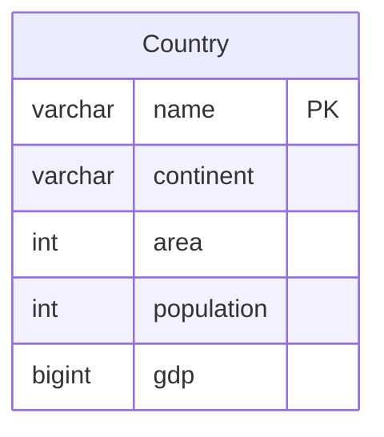

# leetcode : 595. Big Countries
* [[leetcode : 595. Big Countries]](https://leetcode.com/problems/big-countries/description/)
<br>

---

## 문제


<br>

## 문제 풀이

### **MySQL**
```SQL
SELECT NAME, POPULATION, AREA
FROM WORLD
WHERE AREA >= 3000000 OR POPULATION >= 25000000
```

* 그냥 OR 조건
  
### **Pandas**
```python
def big_countries(world: pd.DataFrame) -> pd.DataFrame:
    return world[(world['area'] >= 3000000) | (world['population'] >= 25000000)][['name','population','area']]

def big_countries(world: pd.DataFrame) -> pd.DataFrame:
    cond1 = world['area'] >= 3000000
    cond2 = world['population'] >= 25000000
    return world[cond1|cond2][['name','population','area']]
```

* 그냥 OR 조건
* 문제풀이 하다보니, 아래처럼 cond를 따로 만들어주는 경우에는 시간적으로 손해를 볼 수 밖에 없는듯.
* 특히 or 조건이라 row 단위로 검사할 때 앞 조건만 맞으면 true 처리하고 넘어가는데, cond1 cond2를 할당하면 꽉찬 full scan 두 번에 리턴에서 한 번 더 진행한다.
* 가독성과 적당히 타협해서 써야할듯

<br>

### **코멘트**
* 기본문제
