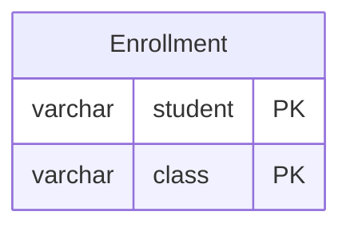

# leetcode : 596. Classes More Than 5 Students
* [[leetcode : 596. Classes More Than 5 Students]](https://leetcode.com/problems/classes-more-than-5-students/description/)
<br>

---

## 문제


<br>

## 문제 풀이

### **MySQL**
```SQL
SELECT CLASS
FROM COURSES
GROUP BY CLASS
HAVING COUNT(CLASS) >= 5
```

* 단순 GROUP BY COUNT
  
### **Pandas**
```python
def find_classes(courses: pd.DataFrame) -> pd.DataFrame:
    count = courses.groupby('class').size().reset_index(name='count')
    return count[count['count'] >= 5][['class']]

def find_classes(courses: pd.DataFrame) -> pd.DataFrame:
    count = courses.groupby('class')['student'].count().reset_index()
    count = count.rename(columns={'student': 'count'})
    return count[count['count'] >= 5][['class']]

def find_classes(courses: pd.DataFrame) -> pd.DataFrame:
    count = courses.groupby('class').agg({'student': 'count'}).reset_index()
    count.columns = ['class', 'count']
    return count[count['count'] >= 5][['class']]


```

* groupby size로 구해주고, 카운팅 컬럼명 reset index로 지정해주기.
  
* groupby size / count의 차이점은 컬럼명 없음 / 컬럼명 유지한다는 것.
  * groupby + size는 연산 후 | class    | 0 |  이런식으로 컬럼명이 나오고, name을 사용하면 0이 'count'로 할당된다.
  * groupby + count는 연산 후 | class    | student | 이렇게 나온다. class로 묶고, student 수가 나온다.

* 마지막처럼 group by + agg를 쓰는 것을 선호하긴 한다.
  * agg 전달 시, 저렇게 딕션너리로 key = ['col1','col2'] 이런식으로 전달하면 위 solution 1,2와 비슷하고다.
  * agg 전달 시 'new_col' = ('col1','agg_func') 이런식으로 설정하는 것을 제일 선호함.

<br>

### **코멘트**
* 쉬운 문제
