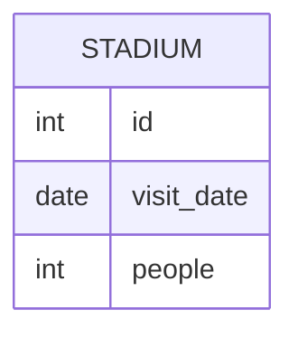

# leetcode : 601. Human Traffic of Stadium

* [[leetcode : 601. Human Traffic of Stadium]](https://leetcode.com/problems/human-traffic-of-stadium/description/)

---

### **다이어그램**


### **목표**
> Write a solution to `display the records with three or more rows with consecutive id's, and the number of people is greater than or equal to 100 for each.`
> Return the result table ordered by visit_date in ascending order.
>
> `각 행의 사람이 3번 연속 100 이상인 row 정보 추출하기. id는 auto increase라서 정렬할 필요는 없다`

<br>

## 문제 풀이

### **MySQL**

```SQL
-- Solution 1
WITH CONSECUTIVE AS (
    SELECT *
    FROM (
        SELECT *,
            LAG(PEOPLE) OVER (ORDER BY VISIT_DATE) AS PREV_PEOPLE,
            LEAD(PEOPLE) OVER (ORDER BY VISIT_DATE) AS NEXT_PEOPLE
        FROM STADIUM
        ) AS TEMP
    WHERE PEOPLE >= 100 AND PREV_PEOPLE >= 100 AND NEXT_PEOPLE >= 100
    )

SELECT *
FROM STADIUM
WHERE ID IN (
    SELECT ID FROM CONSECUTIVE
    UNION
    SELECT ID+1 FROM CONSECUTIVE
    UNION
    SELECT ID-1 FROM CONSECUTIVE
)
ORDER BY VISIT_DATE

-- Solution 2
with q1 as (
select *, 
     count(*) over( order by id range between current row and 2 following ) following_cnt,
     count(*) over( order by id range between 2 preceding and current row ) preceding_cnt,
     count(*) over( order by id range between 1 preceding and 1 following ) current_cnt
from stadium
where people > 99
)
select id, visit_date, people
from q1
where following_cnt = 3 or preceding_cnt = 3 or current_cnt = 3
order by visit_date
```

* Solution 1 : lead + lag
  * LEAD, LAG로 이전행, 다음행 모두 조건을 만족하는 CTE를 만든다.
  * 이 테이블에 있는 ID에 +- 1을 해준 데이터들도 정답이므로 UNION을 통해서 가져오기.
  
* Solution 2:
  * 1등 풀이인데, 자신 포함 위 아래 행이 조건을 만족시키면 카운팅해준다.
  * 3개 모두 만족시키는 행만 불러오는 풀이.

* Solution 3:
  * 

### **Pandas**

```PYTHON
# Solution 1
def human_traffic(stadium: pd.DataFrame) -> pd.DataFrame:
    stadium['prev_people'] = stadium['people'].shift(1)
    stadium['next_people'] = stadium['people'].shift(-1)

    answer = set()
    for idx, row in stadium.iterrows():
        if pd.notnull(row['people']) and pd.notnull(row['prev_people']) and pd.notnull(row['next_people']) and \
           row['people'] >= 100 and row['prev_people'] >= 100 and row['next_people'] >= 100:
            answer.update((row['id'],row['id']-1,row['id']+1))

    return stadium[stadium['id'].isin(answer)][['id','visit_date','people']]

# Solution 2
def human_traffic(stadium: pd.DataFrame) -> pd.DataFrame:
    stadium['prev_people'] = stadium['people'].shift(1)
    stadium['next_people'] = stadium['people'].shift(-1)

    cond1 = stadium['prev_people']>=100
    cond2 = stadium['people']>=100
    cond3 = stadium['next_people']>=100
    ids = set(stadium[cond1&cond2&cond3]['id'])
    
    return stadium[stadium['id'].isin(ids | {i-1 for i in ids} | {i+1 for i in ids})][['id','visit_date','people']]

# Solution 3
def human_traffic(stadium: pd.DataFrame) -> pd.DataFrame:
    cond = stadium['people'].rolling(window=3).min() >= 100
    return stadium[cond|cond.shift(-1)|cond.shift(-2)]
```

* Solution 1: shift + iterrows
  * 한 번 iteration 시키는게 훨씬 나을줄 알았는데 완전 느림...
  * row base가 느리긴 한 듯

* Solution 2: shift + isin
  * 3개 연속으로 100 넘는 행의 id를 먼저 구한다.
  * 조건문에서 ids값에서 +- 1 값들을 더한 집합 안에 들어있는 행들을 모두 불러오기.
  
* Solution 3: rolling + min
  * 이전에 풀었던 문제에서도 구간 내 최소값으로 조건을 걸어서 푸는게 있었다.
  * boolean indexing된 결과 자체도 shift로 풀이가 가능하다.

<br>

### **코멘트**

* 윈도우 함수도 슬슬 익숙해져서 금방 풀린다.