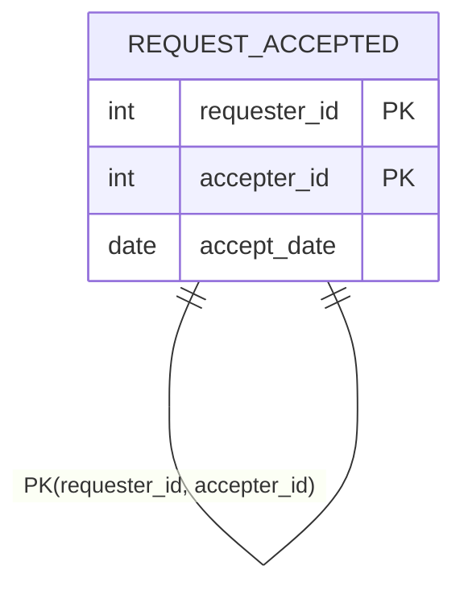

# leetcode : 602. Friend Requests II: Who Has the Most Friends

* [[leetcode : 602. Friend Requests II: Who Has the Most Friends]](https://leetcode.com/problems/friend-requests-ii-who-has-the-most-friends/description/)

<br>

---

### **다이어그램**


### **목표**
> Write a solution to `find the people who have the most friends and the most friends number.`
>
> The test cases are generated so that only one person has the most friends.


<br>

## 문제 풀이

### **MySQL**
```SQL
--  Solution 1
WITH REQS AS (
    SELECT REQUESTER_ID, COUNT(*) AS NUM
    FROM REQUESTACCEPTED
    GROUP BY REQUESTER_ID
    ),
    ACEPS AS (
    SELECT ACCEPTER_ID, COUNT(*) AS NUM
    FROM REQUESTACCEPTED
    GROUP BY ACCEPTER_ID
    ),
    TEMP AS (
    SELECT REQUESTER_ID AS ID, NUM
    FROM REQS
    UNION ALL
    SELECT ACCEPTER_ID AS ID, NUM
    FROM ACEPS
    )

SELECT ID, SUM(NUM) AS NUM
FROM TEMP
GROUP BY ID
ORDER BY NUM DESC
LIMIT 1

-- Solution 2
SELECT ID, SUM(NUM) AS NUM
FROM (
    SELECT REQUESTER_ID AS ID, COUNT(*) AS NUM
    FROM REQUESTACCEPTED
    GROUP BY REQUESTER_ID
    UNION ALL
    SELECT ACCEPTER_ID AS ID, COUNT(*) AS NUM
    FROM REQUESTACCEPTED
    GROUP BY ACCEPTER_ID) AS SUB
GROUP BY ID
ORDER BY NUM DESC
LIMIT 1
```

* Solution 1
  * CTE를 통해서 각 사람이 몇 번 요청을 보내고, 몇 번 받았는지 확인하기.
  * 풀고보니까 CTE를 여러개 쓸 필요가 없었다.
  * 중요한건, UNION을 통해서 유저별 받은 수, 보낸 수를 GROUP BY로 통합해서 계산하기.

    ```TEXT
    | REQUESTER_ID | REQ | ACCEPTER_ID | ACEP |
    | ------------ | --- | ----------- | ---- |
    | 1            | 2   | null        | null |
    | 2            | 1   | 2           | 1    |
    | 3            | 1   | 3           | 2    |
    ```

* Solution 2
  * req에서 한 번 GROUP BY + COUNT, acpt에서 한 번 GROUP BY + COUNT
  * UNION ALL로 합쳐서 계산해주기.
  
### **Pandas**
```python

# Solution 1
import pandas as pd
from collections import defaultdict as dd

def most_friends(request_accepted: pd.DataFrame) -> pd.DataFrame:
    
    table = dd(int)
    for _, row in request_accepted.iterrows():
        a, b = row['requester_id'], row['accepter_id']
        table[a] += 1
        table[b] += 1
    
    iden, num = max(table.items(), key=lambda x: x[1])

    return pd.DataFrame({'id': [iden], 'num': [num]})

# Solution 2
def most_friends(request_accepted: pd.DataFrame) -> pd.DataFrame:
    group1 = request_accepted.groupby('requester_id').size().reset_index(name='num').rename(columns={'requester_id': 'id'})
    group2 = request_accepted.groupby('accepter_id').size().reset_index(name='num').rename(columns={'accepter_id': 'id'})
    answer = pd.concat([group1, group2])
    answer_grouped = answer.groupby('id').sum().reset_index()
    return answer_grouped[answer_grouped['num']==answer_grouped['num'].max()][['id','num']]

# Solution 3
def most_friends(request_accepted: pd.DataFrame) -> pd.DataFrame:
    cnt1 = pd.DataFrame(request_accepted['requester_id'].value_counts().reset_index(name='num')).rename(columns={'requester_id':'id'})
    cnt2 = pd.DataFrame(request_accepted['accepter_id'].value_counts().reset_index(name='num')).rename(columns={'accepter_id':'id'})

    answer =  pd.concat([cnt1,cnt2]).groupby('id').sum().reset_index()
    return answer[answer['num']==answer['num'].max()]

# Solution 4
def most_friends(request_accepted: pd.DataFrame) -> pd.DataFrame:
    return (
        pd.concat([request_accepted.requester_id, request_accepted.accepter_id])
    .to_frame('id')
        .value_counts()
        .reset_index(name='num')
        .head(1)
    )
```

* Solution 1 : iterrows
  * 한 번의 순회로 카운팅을 해주는게 나을거같아서 iterrows로 풀이.
  * 다른 추가 연산이 없어서 속도도 다른 코드들에 비해 나쁘지 않은편

* Solution 2 : gruop by + concat
  * group by + concat으로 요청 수 합해주기.
  * 마지막에는 order by + head(1)이든 max로 조회하든 상관없을듯

* Solution 3: value_counts + concat

* Solution 4:
  * Solution 2,3을 조금 똑똑하게 풀면 이런식으로 풀 수 있다.
  
<br>

### **코멘트**
* .
