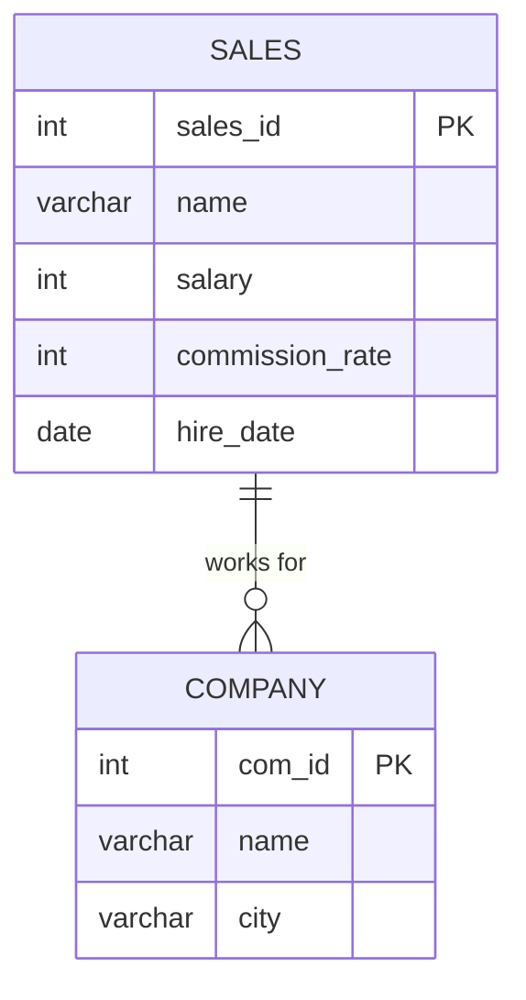

# leetcode : 607. Sales Person
* [[leetcode : 607. Sales Person]](https://leetcode.com/problems/sales-person/description/)
<br>

---

### **다이어그램**


<br>

## 문제 풀이

### **MySQL**
```SQL
SELECT NAME
FROM SALESPERSON
WHERE SALES_ID NOT IN (
    SELECT SALES_ID
    FROM ORDERS
    WHERE COM_ID = (SELECT COM_ID FROM COMPANY WHERE NAME = 'RED'))
```

* RED 회사 넘버를 찾은 다음 ORDER TABLE에서 COM_ID가 RED와 관련있는 것들을 모두 뽑는다.
* SALES_ID가 이 서브쿼리에 없으면 된다. NOT IN 사용해서 작성하기.
  
### **Pandas**
```python
def sales_person(sales_person: pd.DataFrame, company: pd.DataFrame, orders: pd.DataFrame) -> pd.DataFrame:
    red = company[company['name'] == 'RED'][['com_id']]
    red_sales = orders[orders['com_id'].isin(red['com_id'])][['sales_id']]
    return sales_person[~sales_person['sales_id'].isin(red_sales['sales_id'])][['name']]
```

* isin을 사용해서 데이터프레임에 조건 걸어주기.
* SQL에서 두 번의 서브쿼리를 사용하듯이 두 개의 임시 데이터프레임을 만들고 isin으로 조건을 걸어준다.
  
<br>

### **코멘트**
* 쉬운 문제
