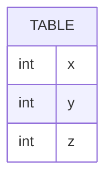

# leetcode : 610. Triangle Judgement
* [[leetcode : 610. Triangle Judgement]](https://leetcode.com/problems/triangle-judgement/description/)
<br>

---

### **다이어그램**


### **목표**
> `삼각형 조건 만족하는지 확인하기`

<br>

## 문제 풀이

### **MySQL**
```SQL
-- Solution 1
SELECT *,IF(X+Y<=Z OR Y+Z<=X OR Z+X<=Y, "No", "Yes") AS TRIANGLE
FROM TRIANGLE
```

* 간단한 BINARY 조건문이니 IF 사용하기
* 조건문에서 개별 조건들을 최대한 조금만 통과하게 AND 대신 OR를 사용하기.
  
### **Pandas**
```python
# Solution 1 
def triangle_judgement(triangle: pd.DataFrame) -> pd.DataFrame:
    def check(row):
        x,y,z = row['x'],row['y'],row['z']
        if x+y>z and y+z>x and z+x>y:
            return 'Yes'
        return 'No'
 
    triangle['triangle'] = triangle.apply(check, axis=1)
    return triangle

# Solution 2 
def triangle_judgement(triangle: pd.DataFrame) -> pd.DataFrame:
 
    triangle['triangle'] = np.where((triangle['x'] + triangle['y'] <= triangle['z']) |
                                    (triangle['y'] + triangle['z'] <= triangle['x']) |
                                    (triangle['z'] + triangle['x'] <= triangle['y']),
                                    'No', 'Yes')
    return triangle
```

* Solution 1: apply
  * apply로 접근하기.
  * apply 함수 적용 시, 각 row를 입력으로 받는다.
  
* Solution 2: np.where
  * np.where로 접근하기. (SQL의 IF와 같은 역할을 한다)
  * IF문을 중첩해서 쓰기보다는 case when을 쓰는 것 처럼 간단한 경우에 사용하기.
  * AND, OR 접근 시 최대한 많은 조건을 통과하지 않게 조건을 반대로 걸고 AND/OR도 반대로 쓰기
  
<br>

### **코멘트**
* 쉬운 문제
