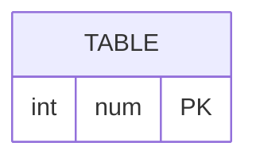

# leetcode : 619. Biggest Single Number
* [[leetcode : 619. Biggest Single Number]](https://leetcode.com/problems/biggest-single-number/description/)
<br>

---

### **다이어그램**


### **목표**
> `한 번만 등장하는 숫자 중 가장 큰 수`

<br>

## 문제 풀이

### **MySQL**
```SQL
-- Solution 1
SELECT MAX(NUM) AS NUM
FROM (
    SELECT *
    FROM MYNUMBERS
    GROUP BY NUM
    HAVING COUNT(NUM) <= 1
    ORDER BY NUM DESC) AS TEMP

-- Solution 2
SELECT 
  COALESCE((
      SELECT NUM
      FROM (
          SELECT NUM, COUNT(*) AS CNT
          FROM MYNUMBERS
          GROUP BY NUM
          HAVING CNT = 1
          ) SUB
      ORDER BY NUM DESC
      LIMIT 1
  ), NULL) AS NUM
```

* Solution 1: 서브쿼리 + MAX
  * 서브쿼리 사용해주기.
  * 집계함수에 아무것도 없으면 null을 반환한다.
  
* Solution 2: 서브쿼리 + ORDER BY
  * NULL처리가 안돼서 COALESCE

### **Pandas**
```python
# Solution 1
def biggest_single_number(my_numbers: pd.DataFrame) -> pd.DataFrame:
    cnt = my_numbers['num'].value_counts()
    cnt_unique = cnt[cnt == 1]
    if cnt_unique.empty:
        return pd.DataFrame({'num': [None]})
    return pd.DataFrame({'num': [cnt_unique.index.max()]})

# Solution 2
def biggest_single_number(my_numbers: pd.DataFrame) -> pd.DataFrame:
    my_numbers = my_numbers.drop_duplicates('num', keep=False)
    return pd.DataFrame({'num': [my_numbers['num'].max()]})
```

* Solution 1
  * 각 숫자가 몇 번 나왔는지 체크한 후, 1개인 것만 가져오기.
  * 데이터프레임이 비어있는 경우를 생각해서 추가로 지정
  * index랑 집계함수를 같이쓰는 메서드 체인이 자주 등장한다. 사용법 익히기!

* Solution 2
  * 1등 풀이.
  * drop duplicates를 사용해서 등장한 숫자들만 남긴다. (False는 중복행을 모두 삭제한다)
  * 이 중 최대값을 가져오기.
  
<br>

### **코멘트**
* 카운팅 횟수가 의미 없어지는 문제에서 drop duplicates가 상당히 좋아보임