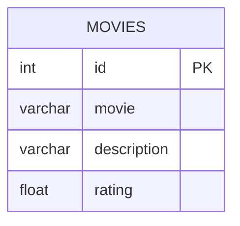

# leetcode : 620. Not Boring Movies
* [[leetcode : 620. Not Boring Movies]](https://leetcode.com/problems/not-boring-movies/description/)
<br>

---

### **다이어그램**


### **목표**
> `id 홀수 & 지루하지 않은 영화`

<br>

## 문제 풀이

### **MySQL**
```SQL
SELECT *
FROM CINEMA
WHERE ID%2 = 1 AND DESCRIPTION != 'boring'
ORDER BY RATING DESC
```

* 기본 문제
  
### **Pandas**
```python
# Solution 1
def not_boring_movies(cinema: pd.DataFrame) -> pd.DataFrame:
    return cinema[(cinema['id']%2) & (cinema['description'] != 'boring')].sort_values('rating', ascending=False)
```

* Solution 1: 조건 + sort_values
  
<br>

### **코멘트**
* 기본문제
