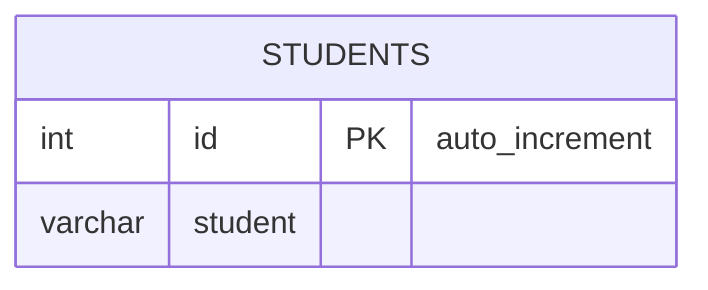

# leetcode : 626. Exchange Seats
* [[leetcode : 626. Exchange Seats]](https://leetcode.com/problems/exchange-seats/description/)
<br>

---

### **다이어그램**


### **목표**
> `홀짝 인덱스 스왑하기`

<br>

## 문제 풀이

### **MySQL**
```SQL
-- Solution 1
WITH SWAP_SEAT AS(
    SELECT *,
        CASE 
            WHEN MOD(ID,2) THEN LEAD(ID) OVER (ORDER BY ID)
            ELSE LAG(ID) OVER (ORDER BY ID)
        END AS SWAP
    FROM SEAT
    )

SELECT COALESCE(SWAP, (SELECT COUNT(*) FROM SWAP_SEAT)) AS ID, STUDENT
FROM SWAP_SEAT
ORDER BY ID;

-- Solution 2
SELECT 
    CASE 
        WHEN ID = (SELECT MAX(ID) FROM SEAT) AND ID%2=1 THEN ID 
        WHEN ID%2=1 THEN ID+1
        ELSE ID-1
    END AS ID,
    STUDENT
FROM SEAT
ORDER BY ID
```
* Solution 1: CTE LEAD, LAG
  * 홀수 짝수에 맞춰서 lead lag를 case when 조건문으로 가져온다.
  * 마지막 홀수id는 항상 뒤에거를 가져와야 하는데 가져올 수 없어서 NULL값이다.
  * 이 부분을 COALESCE를 사용해주면 된다.
  
* Solution 2: CASE WHEN
  * 마지막 홀수 ROW면 그대로
  * 아니면 SWAP
  
### **Pandas**
```python
# Solution 1
def exchange_seats(seat: pd.DataFrame) -> pd.DataFrame:
    h = len(seat)
    seat['swap_id'] = seat.apply(lambda x: min(x['id']+1,h) if x['id']%2 else min(x['id']-1,h), axis=1)
    seat.sort_values('swap_id', inplace=True)
    seat.drop(columns=['id'],inplace=True)
    seat.rename(columns={'swap_id':'id'}, inplace=True)
    return seat[['id','student']]

# Solution 2
  def exchange_seats(seat: pd.DataFrame) -> pd.DataFrame:
    odd = seat[seat['id']%2==1]
    odd['id'] = odd['id'] + 1
    even = seat[seat['id']%2==0]
    even['id'] = even['id'] - 1
    answer = pd.concat([odd,even]).sort_values('id')
    answer['id'] = range(1,answer.shape[0]+1)
    return answer
```
* Solution 1
  * apply를 통해서 한 번에 해결해주기.
  * 마지막 id를 처리해주기 위해서 min값을 사용.
  * 마지막 id+1은 튜플수보다 많아서 최대치를 튜플 수를 h로 정해버린다.
  
* Solution 2
  * odd, even 따로 구한 후 인덱스 연산 해주기.
  * concat으로 없애고 합쳐주고 순서 정렬한다음 range로 id 재할당해주기.
  
<br>

### **코멘트**
* 쉬운 문제