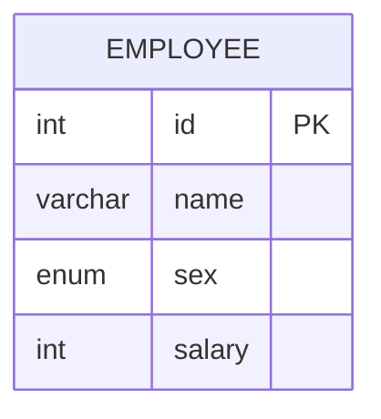

# leet : 627. Swap Salary
* [[leet : 627. Swap Salary]](https://leetcode.com/problems/swap-salary/description/)
<br>

---

### **다이어그램**


### **목표**
> `m과 f를 서로 스왑하기`

<br>

## 문제 풀이

### **MySQL**
```SQL
-- Solution 1
UPDATE SALARY
SET SEX =
    CASE
        WHEN SEX = 'm' THEN 'f'
    ELSE 'm'
    END

-- Solution 2
UPDATE SALARY
SET SEX = IF(SEX='m','f','m')
```

* Solution 1 : CASE WHEN
  * 처음 쓰는 update.
  * update 두 번 써서 바꾸면 한 성별로 바뀌어버리기 때문에 case when 사용
  
* Solution 2 : IF
  
### **Pandas**
```python
# Solution 1
def swap_salary(salary: pd.DataFrame) -> pd.DataFrame:
    salary['sex'] = salary.apply(lambda x: 'f' if x['sex']=='m' else 'm', axis=1)
    return salary

# Solution 2
def swap_salary(salary: pd.DataFrame) -> pd.DataFrame:
    salary['sex'] = np.where(salary['sex']=='m','f','m')
    return salary

# Solution 3
def swap_salary(salary: pd.DataFrame) -> pd.DataFrame:
    salary['sex'] = salary['sex'].map({'f': 'm', 'm': 'f'})
    return salary

# Solution 4
def swap_salary(salary: pd.DataFrame) -> pd.DataFrame:
    salary['sex'] = salary['sex'].replace({'f': 'm', 'm': 'f'})
    return salary
```

* Solution 1 : apply
  * apply 사용해서 업데이트
  
* Solutino 2 : np.where
  
* Solution 3: map

* Solution 4: replace
  * str.replace랑은 다르다.
  * replace는 값 치환, str.replace는 문자열 치환 (패턴, 정규식 기반)
<br>

### **코멘트**
* 기본 문제
