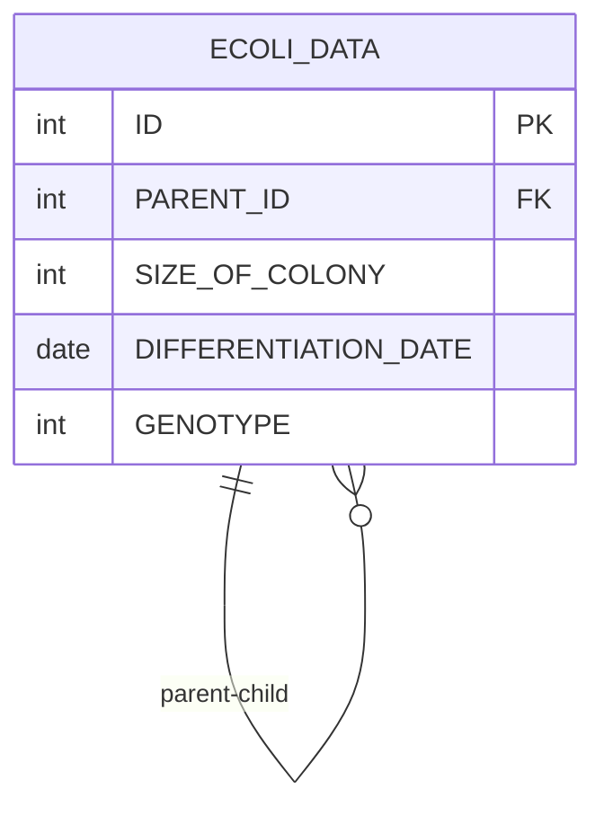

# [SQL] 프로그래머스 : 대장균들의 자식의 수 구하기 (레벨3)

- [[대장균들의 자식의 수 구하기]](https://school.programmers.co.kr/learn/courses/30/lessons/299305)
 
<br>

---

## 다이어그램



## 목표

대장균 개체의 ID(ID)와 자식의 수(CHILD_COUNT)를 출력하는 SQL 문을 작성해주세요. 자식이 없다면 자식의 수는 0으로 출력해주세요. 이때 결과는 개체의 ID 에 대해 오름차순 정렬해주세요.

<br>

## 문제 풀이

### **MySQL**

```SQL
WITH GROUPED AS (
    SELECT PARENT_ID, COUNT(*) AS COUNT
    FROM ECOLI_DATA
    GROUP BY PARENT_ID
)

SELECT E.ID, COALESCE(G.COUNT,0) AS CHILD_COUNT
FROM ECOLI_DATA AS E
LEFT JOIN GROUPED AS G ON E.ID = G.PARENT_ID
ORDER BY E.ID
```

- PARENT로 GROUP BY 해주기.

- LEFT JOIN + COALESCE로 NULL 처리하기

<br>

### **코멘트**

- .