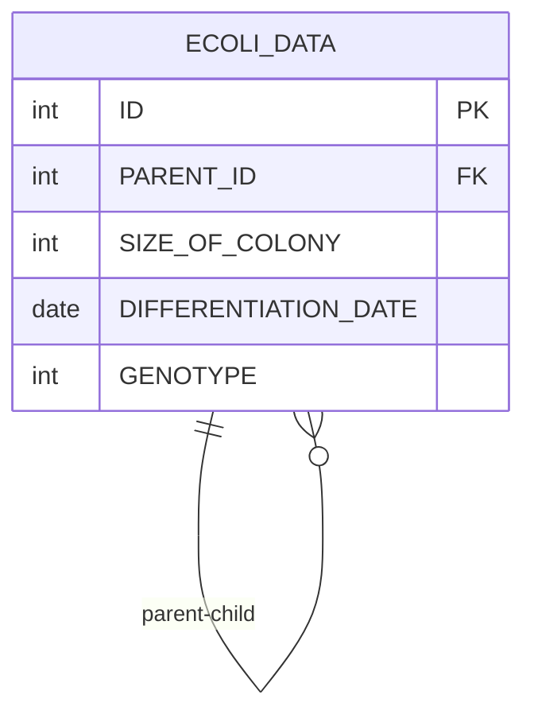

# [SQL] 프로그래머스 : 대장균의 크기에 따라 분류하기 1 (레벨2)

- [[특정 세대의 대장균 찾기]](https://school.programmers.co.kr/learn/courses/30/lessons/299307)
  <br>

---

## 다이어그램



## 목표

대장균 개체의 크기가 100 이하라면 'LOW', 100 초과 1000 이하라면 'MEDIUM', 1000 초과라면 'HIGH' 라고 분류합니다. 대장균 개체의 ID(ID) 와 분류(SIZE)를 출력하는 SQL 문을 작성해주세요.이때 결과는 개체의 ID 에 대해 오름차순 정렬해주세요.

<br>

## 문제 풀이

### **MySQL**

```SQL
SELECT
    ID,
    CASE
        WHEN SIZE_OF_COLONY <= 100 THEN "LOW"
        WHEN SIZE_OF_COLONY <= 1000 THEN "MEDIUM"
        ELSE "HIGH"
    END AS SIZE
FROM ECOLI_DATA
ORDER BY ID
```

- 다중 조건이라서 CASE WHEN으로 풀이

<br>

### **코멘트**

- .
