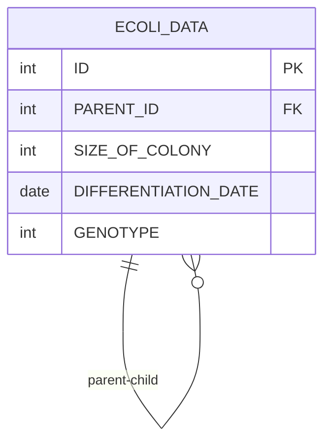

# [SQL] 프로그래머스 : 대장균의 크기에 따라 분류하기 2 (레벨3)

- [[특정 세대의 대장균 찾기]](https://school.programmers.co.kr/learn/courses/30/lessons/301649)
  <br>

---

## 다이어그램



## 목표

대장균 개체의 크기를 내름차순으로 정렬했을 때 상위 0% ~ 25% 를 'CRITICAL', 26% ~ 50% 를 'HIGH', 51% ~ 75% 를 'MEDIUM', 76% ~ 100% 를 'LOW' 라고 분류합니다. 대장균 개체의 ID(ID) 와 분류된 이름(COLONY_NAME)을 출력하는 SQL 문을 작성해주세요. 이때 결과는 개체의 ID 에 대해 오름차순 정렬해주세요 . 단, 총 데이터의 수는 4의 배수이며 같은 사이즈의 대장균 개체가 서로 다른 이름으로 분류되는 경우는 없습니다.

<br>

## 문제 풀이

### **MySQL**

```SQL
# 윈도우함수로 크기 등수 구하기
WITH TEMP AS (
    SELECT
        ID,
        ROW_NUMBER() OVER (ORDER BY SIZE_OF_COLONY DESC) AS PERCENT
    FROM ECOLI_DATA
),

# 등수 -> 퍼센티지
PERCENT AS (
    SELECT
        ID,
        PERCENT / (SELECT COUNT(*) FROM ECOLI_DATA) AS P
    FROM TEMP
)

# CASE WHEN
SELECT
    ID,
    CASE
        WHEN P <= 0.25 THEN 'CRITICAL'
        WHEN P <= 0.5 THEN 'HIGH'
        WHEN P <= 0.75 THEN 'MEDIUM'
        ELSE 'LOW'
    END AS COLONY_NAME
FROM PERCENT
ORDER BY ID
```

- ROW_NUMBER -> 등수 구하기 -> 퍼센티지 구하기 -> CASE WHEN

- 데이터가 4의 배수로 주어져서 퍼신티지가 딱 떨어지게 나왔다.

- 그렇지 않은 경우 CASE WHEN 조건 잘 걸어주기.

- 경계값에서는 BETWEEN 사용 조심하기

<br>

### **코멘트**

-
