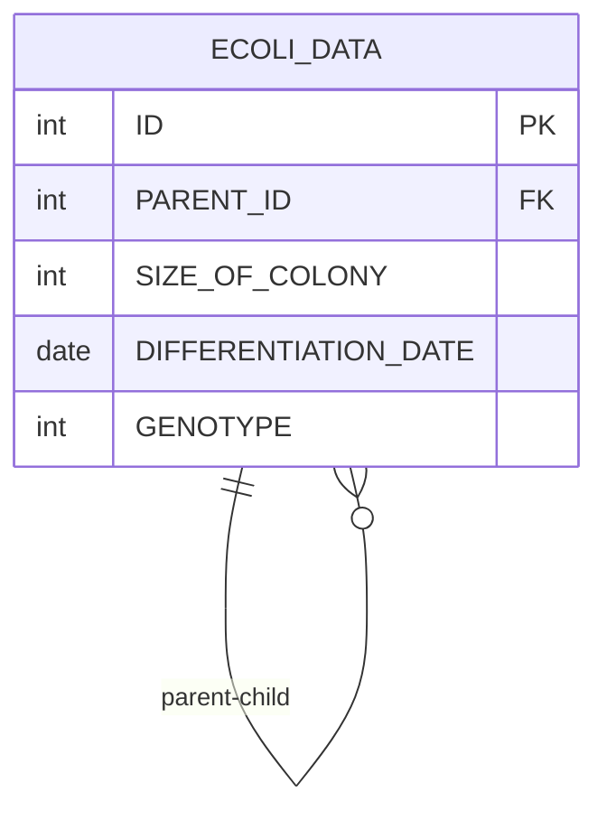

[SQL] 프로그래머스 : 멸종위기의 대장균 찾기 (레벨5)
===

* [[멸종위기의 대장균 찾기]](https://school.programmers.co.kr/learn/courses/30/lessons/301651)
<br>

---

## 다이어그램


## 목표

각 세대별 자식이 없는 개체의 수(COUNT)와 세대(GENERATION)를 출력하는 SQL문을 작성해주세요. 이때 결과는 세대에 대해 오름차순 정렬해주세요. 단, 모든 세대에는 자식이 없는 개체가 적어도 1개체는 존재합니다.

* 테이블이 1개인데 INNER JOIN을 하는 방식으로 풀어야 함을 유추할 수 있다.

<br>

## 문제 풀이

### **MySQL**
```SQL
# 세대 찾기
WITH RECURSIVE GEN AS (

    # NULL인거에 1세대를 부여한다
    SELECT ID, PARENT_ID, 1 AS GENERATION
    FROM ECOLI_DATA
    WHERE PARENT_ID IS NULL

    # 이후 1세대인 ID와 PARENT_ID가 일치하는 애들은 세대 + 1
    UNION ALL
    SELECT e.ID, e.PARENT_ID, g.GENERATION + 1
    FROM ECOLI_DATA e
    INNER JOIN GEN g ON e.PARENT_ID = g.ID
),
# 부모 없는 대장균. JOIN이나 서브쿼리로 처리하기
NO_PARENT AS (
    SELECT g1.ID, g1.GENERATION
    FROM GEN g1
    LEFT JOIN GEN g2 ON g1.ID = g2.PARENT_ID
    WHERE g2.ID IS NULL
)
# GROUP BY + ORDER BY
SELECT COUNT(*) AS COUNT, GENERATION
FROM NO_PARENT
GROUP BY GENERATION
ORDER BY GENERATION
```

* 각 세대를 찾기 위해 RECULSIVE CTE를 사용한다.

* 처음 써봤는데, 첫 CTE 내부 쿼리에서는 초기값을 할당하고, 그 이후로는 UNION ALL로 테이블을 계속 병합하는 방식

* 세대를 구했으면 다른 문제들과 똑같이 풀 수 있다.

<br>

### **코멘트**
* 프로그래머스는 약간 과한 문제가 종종 있는듯...