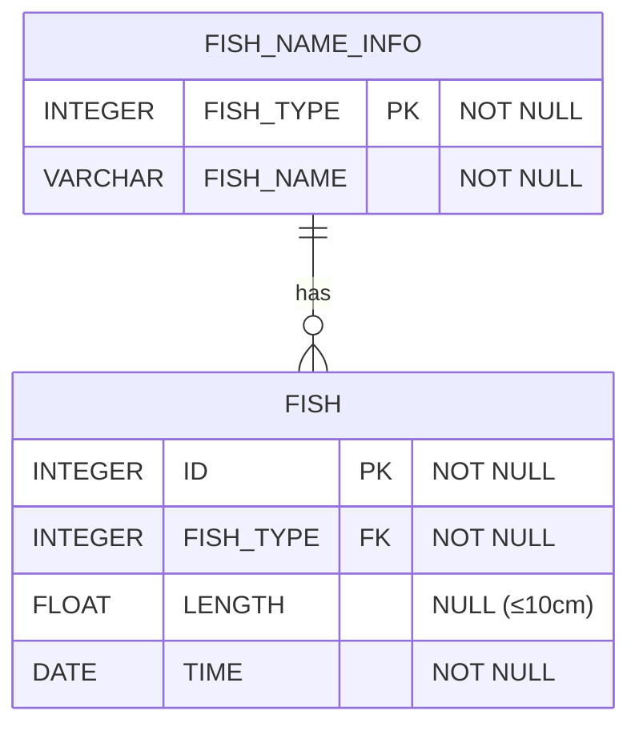

# [SQL] 프로그래머스 : 물고기 종류 별 대어 찾기 (레벨3)

- [[프로그래머스 : 물고기 종류 별 대어 찾기]](https://school.programmers.co.kr/learn/courses/30/lessons/293261)
  
<br>

---

## 다이어그램



## 목표

물고기 종류 별로 가장 큰 물고기의 ID, 물고기 이름, 길이를 출력하는 SQL 문을 작성해주세요.

물고기의 ID 컬럼명은 ID, 이름 컬럼명은 FISH_NAME, 길이 컬럼명은 LENGTH로 해주세요.
결과는 물고기의 ID에 대해 오름차순 정렬해주세요.
단, 물고기 종류별 가장 큰 물고기는 1마리만 있으며 10cm 이하의 물고기가 가장 큰 경우는 없습니다.

<br>

## 문제 풀이

### **MySQL**

```SQL
WITH TEMP AS (
    SELECT
        I.ID,
        I.FISH_TYPE,
        I.LENGTH,
        N.FISH_NAME
    FROM FISH_INFO AS I
    JOIN FISH_NAME_INFO AS N ON I.FISH_TYPE = N.FISH_TYPE
),

RANKING AS (
    SELECT
        ID,
        FISH_NAME,
        LENGTH,
        ROW_NUMBER() OVER (PARTITION BY FISH_NAME ORDER BY LENGTH DESC) AS RN
    FROM TEMP
)

SELECT ID, FISH_NAME, LENGTH
FROM RANKING
WHERE RN = 1
ORDER BY ID
```

* JOIN -> ROW_NUMBER로 RANKING -> WHERE + ORDER BY

```SQL
WITH TEMP AS (
    SELECT
        ID,
        FISH_TYPE,
        LENGTH,
        ROW_NUMBER() OVER (PARTITION BY FISH_TYPE ORDER BY LENGTH DESC) AS RN
    FROM FISH_INFO
)

SELECT T.ID, N.FISH_NAME, T.LENGTH
FROM TEMP AS T
JOIN FISH_NAME_INFO AS N ON T.FISH_TYPE = N.FISH_TYPE
WHERE RN = 1
ORDER BY **ID**
```

* 조금 더 개선하면, 원본 테이블에서 먼저 ROW NUM을 구하고, JOIN + WHERE + ORDER BY로 과정을 줄일 수 있다.

```SQL
WITH TEMP AS (
    SELECT
        I.ID,
        I.FISH_TYPE,
        I.LENGTH,
        N.FISH_NAME
    FROM FISH_INFO AS I
    JOIN FISH_NAME_INFO AS N ON I.FISH_TYPE = N.FISH_TYPE
)

SELECT T.ID, T.FISH_NAME, T.LENGTH
FROM TEMP T
WHERE EXISTS (
    SELECT 1
    FROM (
        SELECT FISH_TYPE, MAX(LENGTH) AS MAX_LENGTH
        FROM TEMP
        GROUP BY FISH_TYPE
    ) M
    WHERE T.FISH_TYPE = M.FISH_TYPE AND T.LENGTH = M.MAX_LENGTH
)
```

* EXISTS + SUBQUERY
  
* JOINED TABLE을 GROUPBY로 묶고, 최대값을 가지는 물고기 조건을 걸어준 ROW만 EXISTS로 뽑아낸다.

<br>

### **코멘트**

- 물고기 종류 별 가장 큰 물고기가 10CM 이하의 물고기가 없어서 따로 전처리가 필요 없다.
