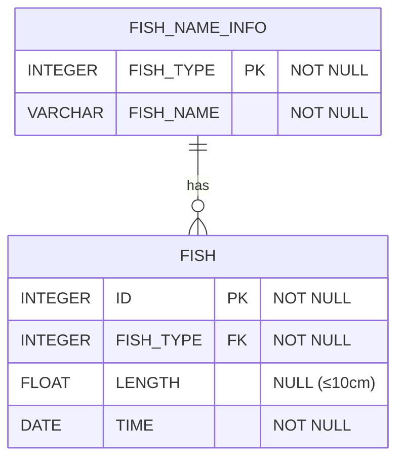

# [SQL] 프로그래머스 : 물고기 종류 별 잡은 수 구하기 (레벨1)

- [[프로그래머스 : 물고기 종류 별 잡은 수 구하기]](https://school.programmers.co.kr/learn/courses/30/lessons/293257)
  
<br>

---

## 다이어그램



## 목표

FISH_NAME_INFO에서 물고기의 종류 별 물고기의 이름과 잡은 수를 출력하는 SQL문을 작성해주세요.

물고기의 이름 컬럼명은 FISH_NAME, 잡은 수 컬럼명은 FISH_COUNT로 해주세요.
결과는 잡은 수 기준으로 내림차순 정렬해주세요.

<br>

## 문제 풀이

### **MySQL**

```SQL
SELECT COUNT(*) AS FISH_COUNT, N.FISH_NAME
FROM FISH_INFO AS I
JOIN FISH_NAME_INFO AS N ON I.FISH_TYPE = N.FISH_TYPE
GROUP BY N.FISH_NAME
ORDER BY COUNT(*) DESC
```

* join 이후 group by

<br>

### **코멘트**

- COUNT(*)과 COUNT(COL)의 차이를 ㅣ해하기