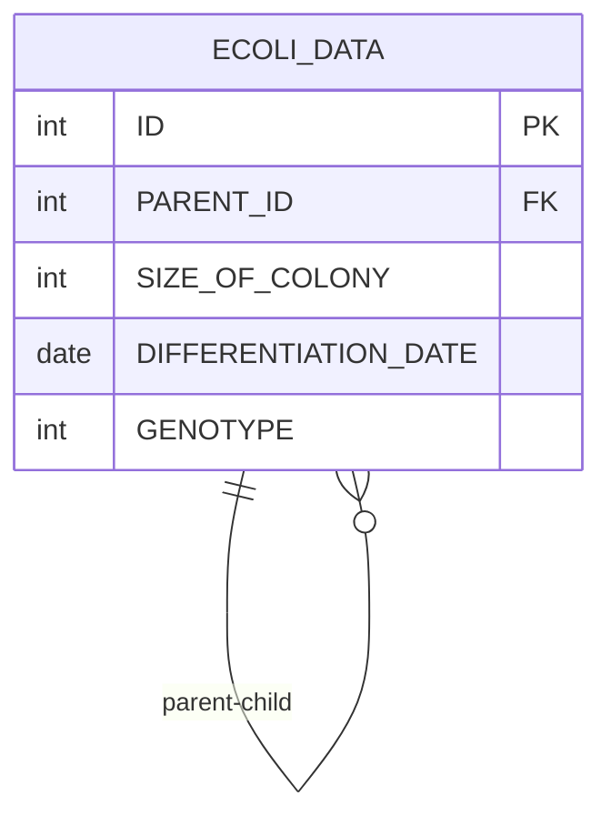

# [SQL] 프로그래머스 : 부모의 형질을 모두 가지는 대장균 찾기 (레벨2)

- [[프로그래머스 : 부모의 형질을 모두 가지는 대장균 찾기]](https://school.programmers.co.kr/learn/courses/30/lessons/301647)
  <br>

---

## 다이어그램



## 목표

3세대의 대장균의 ID(ID) 를 출력하는 SQL 문을 작성해주세요. 이때 결과는 대장균의 ID 에 대해 오름차순 정렬해주세요.

- 테이블이 1개인데 INNER JOIN을 하는 방식으로 풀어야 함을 유추할 수 있다.

<br>

## 문제 풀이

### **MySQL**

```SQL

# 한쪽은 Id를 바탕으로, 한 쪽은 PARENT ID를 바탕으로 조인.
# 비트연산 후에 부모의 ID랑 똑같이 나오면 된다.
SELECT E2.ID, E2.GENOTYPE, E1.GENOTYPE AS PARENT_GENOTYPE
FROM ECOLI_DATA E1
JOIN ECOLI_DATA E2 ON E1.ID = E2.PARENT_ID
WHERE (E1.GENOTYPE & E2.GENOTYPE) = E1.GENOTYPE
ORDER BY E2.ID;
```

<br>

### **코멘트**

- 비트연산도 안나올거같음
