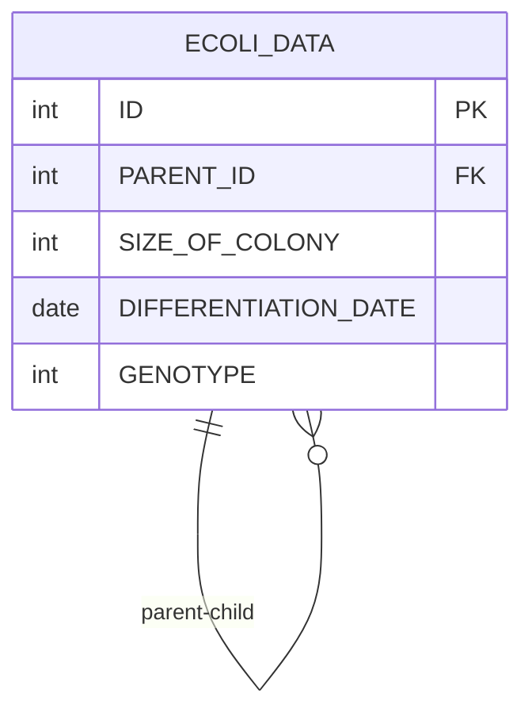

# [SQL] 연도별 대장균 크기의 편차 구하기 (레벨2)

- [[연도별 대장균 크기의 편차 구하기]](https://school.programmers.co.kr/learn/courses/30/lessons/299310)
  <br>

---

## 다이어그램



## 목표

분화된 연도(YEAR), 분화된 연도별 대장균 크기의 편차(YEAR_DEV), 대장균 개체의 ID(ID) 를 출력하는 SQL 문을 작성해주세요. 분화된 연도별 대장균 크기의 편차는 분화된 연도별 가장 큰 대장균의 크기 - 각 대장균의 크기로 구하며 결과는 연도에 대해 오름차순으로 정렬하고 같은 연도에 대해서는 대장균 크기의 편차에 대해 오름차순으로 정렬해주세요.

<br>

## 문제 풀이

### **MySQL**

```SQL
WITH GROUPED AS (
    SELECT YEAR(DIFFERENTIATION_DATE) AS YEAR, MAX(SIZE_OF_COLONY) AS MAX_SIZE
    FROM ECOLI_DATA
    GROUP BY YEAR(DIFFERENTIATION_DATE)
)

SELECT
    G.YEAR,
    (G.MAX_SIZE - E.SIZE_OF_COLONY) AS YEAR_DEV,
    E.ID
FROM ECOLI_DATA AS E
JOIN GROUPED AS G ON YEAR(E.DIFFERENTIATION_DATE) = G.YEAR
ORDER BY YEAR, YEAR_DEV
```

- GROUP BY로 CTE에서 년도별 최대 크기를 구한다.

- JOIN 이후에, GROUP BY + ORDER BY

<br>

### **코멘트**

- .
