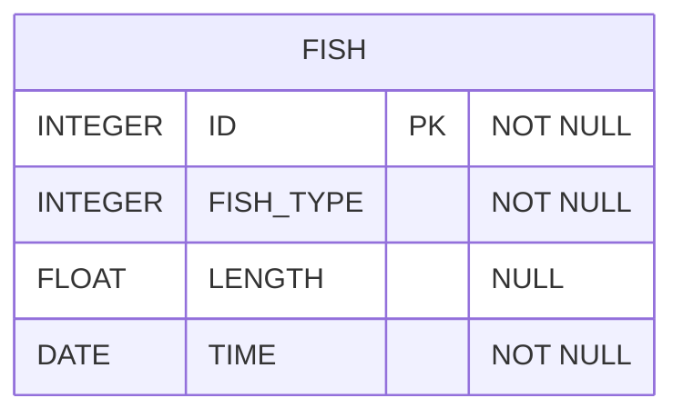

# [SQL] 프로그래머스 : 월별 잡은 물고기 수 구하기 (레벨2)

- [[프로그래머스 : 월별 잡은 물고기 수 구하기]](https://school.programmers.co.kr/learn/courses/30/lessons/293260)
  
<br>

---

## 다이어그램



## 목표

잡은 물고기 수 컬럼명은 FISH_COUNT, 월 컬럼명은 MONTH로 해주세요.
결과는 월을 기준으로 오름차순 정렬해주세요.
단, 월은 숫자형태 (1~12) 로 출력하며 9 이하의 숫자는 두 자리로 출력하지 않습니다. 잡은 물고기가 없는 월은 출력하지 않습니다.

<br>

## 문제 풀이

### **MySQL**

```SQL
SELECT COUNT(*) AS FISH_COUNT, MONTH(TIME) AS MONTH
FROM FISH_INFO
GROUP BY MONTH(TIME)
ORDER BY MONTH(TIME)
```

<br>

### **코멘트**

- 날짜 포매팅 지정할 필요가 없다.

| 플레이스홀더 | 설명                         | 예시        |
|--------------|------------------------------|-------------|
| YYYY         | 4자리 연도                   | 2021        |
| YY           | 2자리 연도                   | 21          |
| MM           | 2자리 월                     | 01, 09, 12  |
| MON          | 월의 약어                    | JAN, SEP    |
| MONTH        | 월의 전체 이름               | JANUARY, SEPTEMBER |
| DD           | 2자리 일                     | 01, 09, 31  |
| DAY          | 요일의 전체 이름             | MONDAY, TUESDAY |
| DY           | 요일의 약어                  | MON, TUE    |
| D            | 요일 (1-7, 일요일이 1)       | 1, 2, 3     |

* WEEKDAY는 0-6이고 월요일 0부터 시작