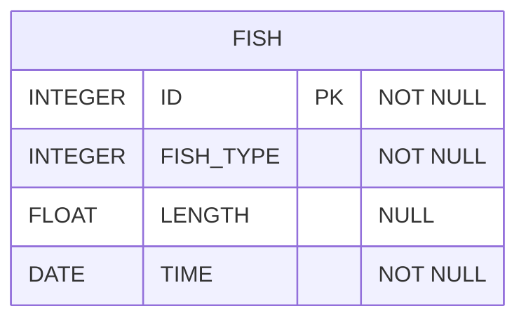

# [SQL] 프로그래머스 : 잔챙이 잡은 수 구하기 (레벨1)

- [[프로그래머스 : 잔챙이 잡은 수 구하기]](https://school.programmers.co.kr/learn/courses/30/lessons/293258)
  
<br>

---

## 다이어그램



## 목표

잡은 물고기 중 길이가 10cm 이하인 물고기의 수를 출력하는 SQL 문을 작성해주세요.

물고기의 수를 나타내는 컬럼 명은 FISH_COUNT로 해주세요.

<br>

## 문제 풀이

### **MySQL**

```SQL
SELECT COUNT(*) AS FISH_COUNT
FROM FISH_INFO
WHERE LENGTH IS NULL
```

<br>

### **코멘트**

* null 처리