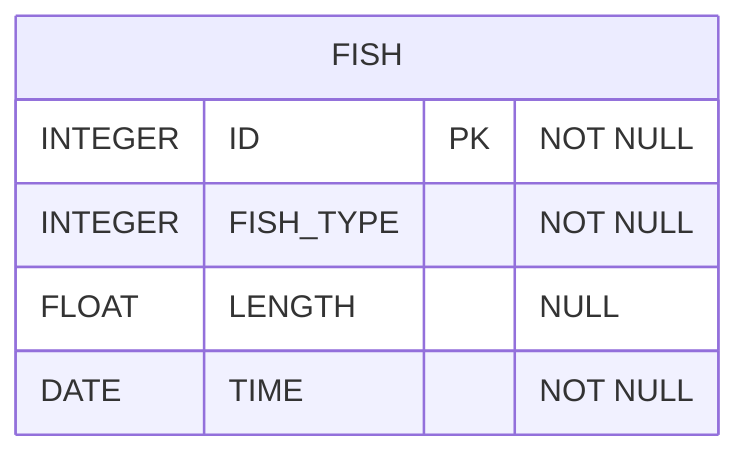

# [SQL] 프로그래머스 : 잡은 물고기의 평균 길이 구하기기 (레벨1)

- [[프로그래머스 : 잡은 물고기의 평균 길이 구하기기]](https://school.programmers.co.kr/learn/courses/30/lessons/293259)
  
<br>

---

## 다이어그램



## 목표

잡은 물고기의 평균 길이를 출력하는 SQL문을 작성해주세요.

평균 길이를 나타내는 컬럼 명은 AVERAGE_LENGTH로 해주세요.
평균 길이는 소수점 3째자리에서 반올림하며, 10cm 이하의 물고기들은 10cm 로 취급하여 평균 길이를 구해주세요.

<br>

## 문제 풀이

### **MySQL**

```SQL
SELECT ROUND(AVG(COALESCE(LENGTH,10)),2) AS AVERAGE_LENGTH
FROM FISH_INFO
```

<br>

### **코멘트**

* null 처리 -> COALESCE로 한 번에 처리하기

* 나눠서 할거면 COALESCE나 IF로 SUBQUERY나 CTE에서 한 번 처리를 하고, 메인 쿼리에서 집계하기