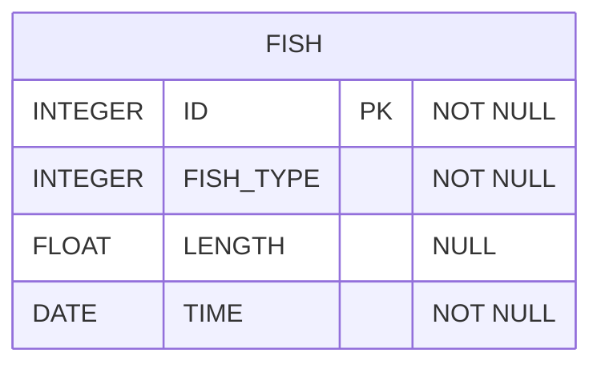

# [SQL] 프로그래머스 : 잡은 물고기 중 가장 큰 물고기의 길이 구하기 (레벨1)

- [[프로그래머스 : 잡은 물고기 중 가장 큰 물고기의 길이 구하기]](https://school.programmers.co.kr/learn/courses/30/lessons/298515)
  
<br>

---

## 다이어그램



## 목표

FISH_INFO 테이블에서 잡은 물고기 중 가장 큰 물고기의 길이를 'cm' 를 붙여 출력하는 SQL 문을 작성해주세요.

이 때 컬럼명은 'MAX_LENGTH' 로 지정해주세요.

<br>

## 문제 풀이

### **MySQL**

```SQL
SELECT DISTINCT CONCAT(LENGTH,"cm") AS MAX_LENGTH
FROM FISH_INFO
WHERE LENGTH = (SELECT MAX(LENGTH) FROM FISH_INFO)
```

* 서브쿼리 사용해서 풀어주기.

* WHERE + SUBQUERY에서 MAX값이 여러 개 인 경우, 다중 행을 반환할 가능성이 있어서 SELECT 절에서 DISTINCT를 사용한다.

```SQL
SELECT CONCAT(LENGTH,"cm") AS MAX_LENGTH
FROM FISH_INFO
ORDER BY LENGTH DESC
LIMIT 1
```

* ORDER BY로 정렬 이후, LIMIT로 상위 1개를 가져와주면 된다.

<br>

### **코멘트**

- .
