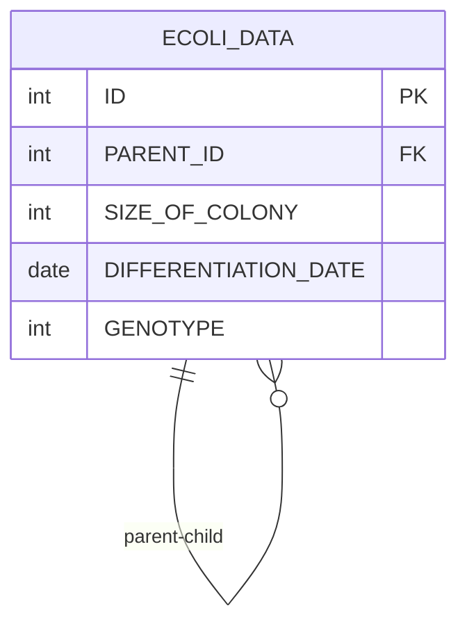

# [SQL] 프로그래머스 : 특정 세대의 대장균 찾기 (레벨4)

- [[특정 세대의 대장균 찾기]](https://school.programmers.co.kr/learn/courses/30/lessons/301650)
  <br>

---

## 다이어그램



## 목표

3세대의 대장균의 ID(ID) 를 출력하는 SQL 문을 작성해주세요. 이때 결과는 대장균의 ID 에 대해 오름차순 정렬해주세요.

- 테이블이 1개인데 INNER JOIN을 하는 방식으로 풀어야 함을 유추할 수 있다.

<br>

## 문제 풀이

### **MySQL**

```SQL
# 세대 찾기
WITH RECURSIVE GENERATION AS (

    SELECT ID, PARENT_ID, 1 AS GEN
    FROM ECOLI_DATA
    WHERE PARENT_ID IS NULL

    UNION ALL
    SELECT E.ID, E.PARENT_ID, G.GEN + 1 AS GEN
    FROM ECOLI_DATA E
    JOIN GENERATION G ON E.PARENT_ID = G.ID
)

# 단순 조건문문
SELECT ID
FROM GENERATION
WHERE GEN = 3
ORDER BY ID
```

- 각 세대를 찾기 위해 RECULSIVE CTE를 사용한다.

- 첫 CTE 내부 쿼리에서는 초기값을 할당하고, 그 이후로는 UNION ALL로 테이블을 계속 병합

- 세대를 구했으면 단순 WHERE + ORDER BY

<br>

### **코멘트**

- RECURSIVE는 안나올거같음
