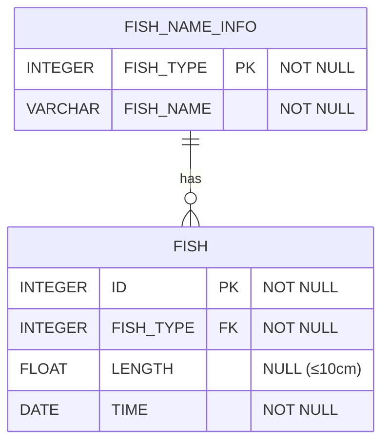

# [SQL] 프로그래머스 : 특정 물고기를 잡은 총 수 구하기 (레벨2)

- [[프로그래머스 : 특정 물고기를 잡은 총 수 구하기]](https://school.programmers.co.kr/learn/courses/30/lessons/298518)
  
<br>

---

## 다이어그램



## 목표

FISH_INFO 테이블에서 잡은 BASS와 SNAPPER의 수를 출력하는 SQL 문을 작성해주세요.

컬럼명은 'FISH_COUNT`로 해주세요.

<br>

## 문제 풀이

### **MySQL**

```SQL
SELECT COUNT(*) AS FISH_COUNT
FROM FISH_INFO AS I
JOIN FISH_NAME_INFO AS N ON I.FISH_TYPE = N.FISH_TYPE
WHERE N.FISH_NAME IN ("BASS",'SNAPPER')
```

* 공통 컬럼으로 JOIN 이후에 WHERE 조건

<br>

### **코멘트**

- .