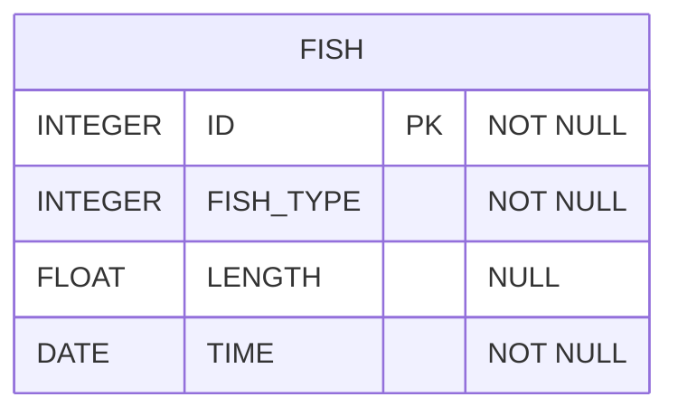

# [SQL] 프로그래머스 : 특정 조건을 만족하는 물고기별 수와 최대 길이 구하기 (레벨3)

- [[프로그래머스 : 특정 조건을 만족하는 물고기별 수와 최대 길이 구하기]](https://school.programmers.co.kr/learn/courses/30/lessons/298519)
  
<br>

---

## 다이어그램



## 목표

FISH_INFO에서 평균 길이가 33cm 이상인 물고기들을 종류별로 분류하여 잡은 수, 최대 길이, 물고기의 종류를 출력하는 SQL문을 작성해주세요. 결과는 물고기 종류에 대해 오름차순으로 정렬해주시고, 10cm이하의 물고기들은 10cm로 취급하여 평균 길이를 구해주세요.

컬럼명은 물고기의 종류 'FISH_TYPE', 잡은 수 'FISH_COUNT', 최대 길이 'MAX_LENGTH'로 해주세요.

<br>

## 문제 풀이

### **MySQL**

```SQL
WITH TEMP AS (
    SELECT
        ID,
        FISH_TYPE,
        IF(LENGTH IS NULL, 10, LENGTH) AS LENGTH,
        TIME
    FROM FISH_INFO
)

SELECT
    COUNT(*) AS FISH_COUNT,
    MAX(LENGTH) AS MAX_LENGTH,
    FISH_TYPE    
FROM TEMP
GROUP BY FISH_TYPE
HAVING AVG(LENGTH) >= 33
ORDER BY FISH_TYPE
```

* Null처리는 COALESCE / IF 등으로 처리하기

* CTE에서 데이터 전처리를 한 후에 GROUP BY + HAVING + ORDER BY

<br>

### **코멘트**

- .
