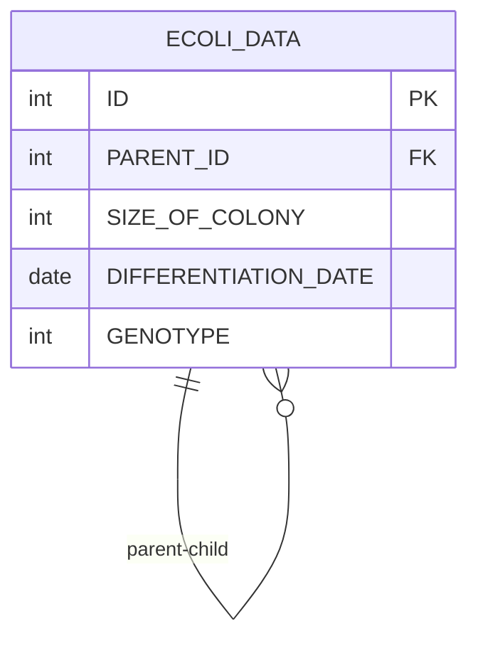

# [SQL] 프로그래머스 : 특정 형질을 가지는 대장균 찾기 (레벨1)

- [[특정 형질을 가지는 대장균 찾기]](https://school.programmers.co.kr/learn/courses/30/lessons/301646)
  <br>

---

## 다이어그램



## 목표

2번 형질이 보유하지 않으면서 1번이나 3번 형질을 보유하고 있는 대장균 개체의 수(COUNT)를 출력하는 SQL 문을 작성해주세요. 1번과 3번 형질을 모두 보유하고 있는 경우도 1번이나 3번 형질을 보유하고 있는 경우에 포함합니다.

<br>

## 문제 풀이

### **MySQL**

```SQL
# 세대 찾기
SELECT COUNT(*) AS `COUNT`
FROM ECOLI_DATA
WHERE (GENOTYPE & 4 = 4 OR GENOTYPE & 1 = 1) AND GENOTYPE & 2 = 0
```

- 비트연산으로 체크해주기.

- 자리수에서 T/F로 체크하는게 아니라 해당 값을 구하는 방식으로 접근
    - 혹은 bit shift로 계산하기

<br>

### **코멘트**

- .
